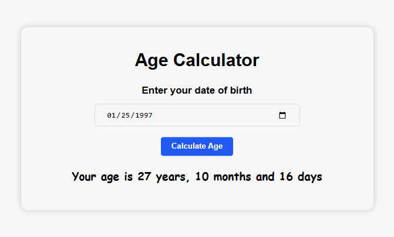

# Age Calculator

The Age Calculator is a simple web application that allows users to calculate their exact age in years, months, and days based on their birthdate. This project is built using pure HTML, SCSS, and TypeScript, providing a user-friendly interface with a clean and modern design.

## Table of Contents

1. [Preview](#preview)
2. [Live Demo](#live-demo)
3. [Features](#features)
4. [Installation & Usage](#installation--usage)
5. [Code Overview](#code-overview)
6. [Technologies Used](#technologies-used)
7. [Author](#author)

## Preview

## Live Demo

View the Age Calculator in action on the [Live Demo](https://simple-age-calculator-web-application.netlify.app/).

## Features

- **User Input:** Users can input their birthdate.
- **Exact Age Calculation:** The application calculates age in years, months, and days.
- **Real-time Calculation:** Age is calculated instantly upon inputting the birthdate.
- **Responsive Design:** The layout works well on various screen sizes.

## Installation & Usage

- [Download ZIP](https://github.com/programmer-rahad/age-calculator/archive/refs/heads/main.zip)
- Extract the downloaded ZIP file.
- Navigate to the project folder and open the `index.html` file in your preferred web browser.
- Enter your birthdate and click on the "Calculate Age" button to see the result.

## Code Overview

- **HTML:** The structure consists of an input field for the birthdate, a button to calculate the age, and a section to display the result.
- **SCSS:** Styles are organized using SCSS to provide a clean, modern look, ensuring responsiveness through media queries.
- **CSS:** Compiled from SCSS, it provides a cohesive design while maintaining responsiveness and clarity.
- **TypeScript:** The TypeScript code calculates the exact age in years, months, and days based on the birthdate and displays it in real-time.
- **JavaScript:** The TypeScript code is compiled to JavaScript, which ensures a seamless user experience.

## Technologies Used

- HTML5
- SCSS (CSS Preprocessor)
- CSS3
- TypeScript
- JavaScript
- Responsive Web Design

## Author

Created and maintained by [Rahad](https://www.rahad.me).  
For inquiries or feedback, feel free to reach out.

**Note:** This project is part of my portfolio and is not intended for use or modification by others.  
All rights are reserved.

If you have any questions or feedback, feel free to contact me via [my website](https://www.rahad.me) or [LinkedIn](https://www.linkedin.com/in/rahadpro) or [email](mailto:rahad.pro.dev@gmail.com).
