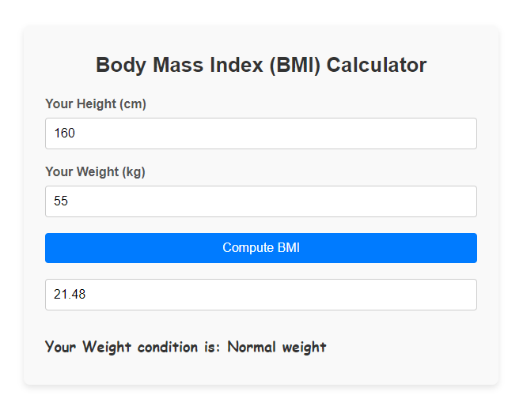

# Body Mass Index (BMI) Calculator

The Body Mass Index (BMI) Calculator is a simple web application that allows users to calculate their BMI based on their height and weight. This project is built using pure HTML, CSS, and JavaScript, and provides a user-friendly interface with smooth animations for an enhanced experience. 

## Table of Contents

1. [Preview](#preview)
2. [Live Demo](#live-demo)
3. [Features](#features)
4. [Installation & Usage](#installation--usage)
5. [Code Overview](#code-overview)
6. [Technologies Used](#technologies-used)
7. [Author](#author)

## Preview

 

## Live Demo

View the BMI Calculator in action on the [Live Demo](https://simple-body-mass-index-calculator.netlify.app).
 

## Features

- **User Input:** Users can input their height in centimeters and weight in kilograms.
- **Real-time Calculation:** BMI is calculated instantly upon clicking the compute button.
- **Clear Results:** Displays weight condition along with the calculated BMI value.
- **Responsive Design:** The layout is responsive and works well on various screen sizes.
- **CSS Animations:** Smooth animations for the input fields and buttons.

## Installation & Usage

- [Download ZIP](https://github.com/programmer-rahad/bmi-calculator/archive/refs/heads/main.zip)
- Extract the downloaded ZIP file.
- Navigate to the project folder and open the `index.html` file in your preferred web browser.
- Enter your height and weight, then click on the "Compute BMI" button to see the result.

## Code Overview

- **HTML:** The structure consists of input fields for height and weight, a button to compute BMI, and a section to display results.
- **SCSS:** Styles are organized using SCSS for a clean, modern look, ensuring responsiveness through media queries.
- **CSS:** Compiled from SCSS, providing a cohesive design while maintaining responsiveness and clarity.
- **Typescript:** Provides enhanced type safety and organizes the JavaScript logic, which calculates BMI and determines the weight condition.
- **Javascript:** Compiled from TypeScript, it implements the BMI calculation logic and updates the user interface with the results for a seamless user experience.

 
## Technologies Used

- HTML5
- SCSS (CSS Preprocessor)
- CSS3
- Typescript 
- JavaScript
- Responsive Web Design

## Author

Created and maintained by [Rahad](https://www.rahad.me).  
For inquiries or feedback, feel free to reach out.

**Note:** This project is part of my portfolio and is not intended for use or modification by others.  
All rights are reserved.

If you have any questions or feedback, feel free to contact me via [my website](https://www.rahad.me) or [LinkedIn](https://www.linkedin.com/in/rahadpro) or [email](mailto:rahad.pro.dev@gmail.com).