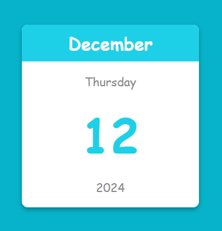

# Digital Calendar

The Digital Calendar is a simple web application that displays the current month, day, date, and year in a user-friendly interface. This project is built using pure HTML, SCSS, and TypeScript, providing a modern design and responsive layout.

## Table of Contents

1. [Preview](#preview)
2. [Live Demo](#live-demo)
3. [Features](#features)
4. [Installation & Usage](#installation--usage)
5. [Code Overview](#code-overview)
6. [Technologies Used](#technologies-used)
7. [Author](#author)

## Preview

## Live Demo

View the Digital Calendar in action on the [Live Demo](https://digital-calendar.netlify.app/).

## Features

- **Dynamic Date Display:** Displays the current month, day, date, and year dynamically.
- **Modern Look:** Clean and modern design with SCSS.
- **Responsive Design:** The layout works well on various screen sizes.

## Installation & Usage

- [Download ZIP](https://github.com/programmer-rahad/digital-calendar/archive/refs/heads/main.zip)
- Extract the downloaded ZIP file.
- Navigate to the project folder and open the `index.html` file in your preferred web browser.
- The calendar will automatically display the current date and time.

## Code Overview

- **HTML:** The structure consists of a container with elements to display the month, day, date, and year.
- **SCSS:** Styles are organized using SCSS to provide a clean, modern look, ensuring responsiveness through media queries.
 - **CSS:** Compiled from SCSS, it provides a cohesive design while maintaining responsiveness and clarity.
- **TypeScript:** The TypeScript code dynamically updates the date, month, day, and year based on the current date.
- **JavaScript:** The TypeScript code is compiled to JavaScript, which ensures a seamless user experience.

## Technologies Used

- HTML5
- SCSS (CSS Preprocessor)
- CSS3
- TypeScript
- JavaScript
- Responsive Web Design

## Author

Created and maintained by [Rahad](https://www.rahad.me).  
For inquiries or feedback, feel free to reach out.
 
**Note:** This project is part of my portfolio and is intended solely for demonstration purposes. Unauthorized use, modification, or redistribution is strictly prohibited. All rights are reserved.
 
If you have any questions or feedback, feel free to contact me via [my website](https://www.rahad.me) or [LinkedIn](https://www.linkedin.com/in/rahadpro) or [email](mailto:rahad.pro.dev@gmail.com).

