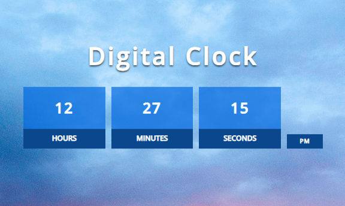

# Digital Clock

This project implements a Digital Clock using HTML, SCSS, and TypeScript. The clock shows the current time in hours, minutes, and seconds, with an AM/PM indicator. The layout is responsive and styled with SCSS for a clean and modern look.

## Table of Contents

1. [Preview](#preview)
2. [Live Demo](#live-demo)
3. [Features](#features)
4. [Installation & Usage](#installation--usage)
5. [Code Overview](#code-overview)
6. [Technologies Used](#technologies-used)
7. [Author](#author)

## Preview

## Live Demo

View the Digital Clock in action on the [Live Demo](https://digital-clock-using-typescript.netlify.app).

## Features

- **Live Clock:** Displays the current time and updates every second.
- **Responsive Design:** Fully responsive layout that adapts to different screen sizes.
- **AM/PM Indicator:** Displays the time in a 12-hour format with AM or PM.
- **Styled with SCSS:** Clean and modern design with customized fonts, spacing, and shadow effects.

## Installation & Usage

1. [Download ZIP](https://github.com/programmer-rahad/digital-clock/archive/refs/heads/main.zip)
2. Extract the downloaded ZIP file to a folder.
3. Navigate to the project folder and open the `index.html` file in your preferred web browser.
4. The clock will automatically display the current time and update every second.

## Code Overview

- **HTML:** The structure contains elements for displaying the hours, minutes, seconds, and AM/PM.
- **SCSS:** Provides modern styles for the clock, including fonts, colors, and responsiveness using media queries. It is compiled into CSS for browser compatibility.
- **TypeScript:** Handles the clock logic, calculates the time, and updates the DOM every second. It is compiled to JavaScript for browser compatibility.

## Technologies Used

- HTML5
- SCSS (CSS Preprocessor)
- TypeScript
- JavaScript
- Responsive Web Design

## Author

Created and maintained by [Rahad](https://www.rahad.me).  
If you have any inquiries or feedback, feel free to reach out via [my website](https://www.rahad.me) or [LinkedIn](https://www.linkedin.com/in/rahadpro) or [email](mailto:rahad.pro.dev@gmail.com).

**Note:** This project is part of my portfolio and is intended solely for demonstration purposes. Unauthorized use, modification, or redistribution is strictly prohibited. All rights are reserved.
